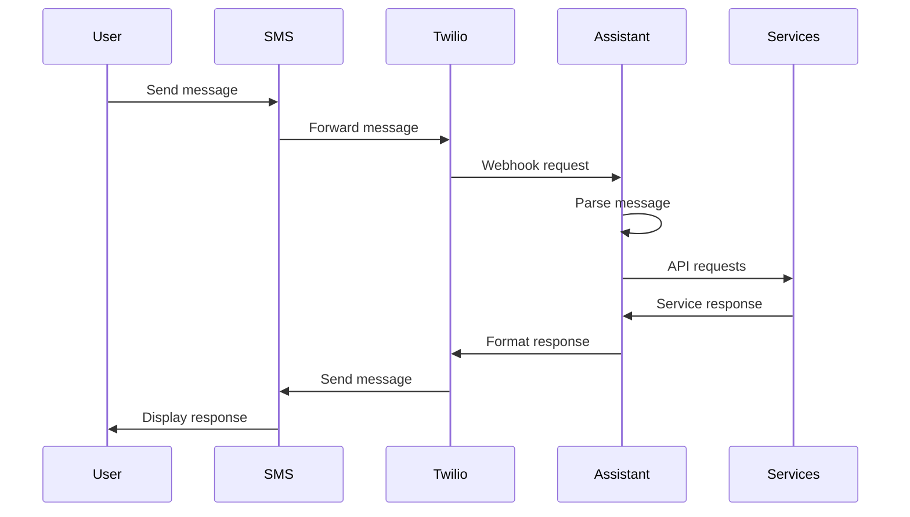

# High-Level Design: SMS Personal Assistant

## 1. System Overview
The system is a personal assistant accessible through SMS that provides multiple services including weather updates, movie recommendations, email access, and public transport information. It uses Twilio for SMS integration and leverages various APIs for different functionalities.

## 2. Architecture Components

### 2.1 Core Components
- **SMS Interface (Twilio)**
  - Handles incoming/outgoing SMS messages
  - Validates requests
  - Manages message queues

- **Long-Term Memory System (Airtable)**
  - Persistent conversation storage
  - Context-aware retrieval
  - Historical interaction tracking
  - Pattern recognition
  - User preference learning
  - Intent-based memory categorization

- **Message Parser**
  - Natural Language Processing (OpenAI)
  - Intent classification
  - Command routing

- **Service Handlers**
  - Weather service (OpenWeather API)
  - Movie recommendations (TMDB API)
  - Email service (IMAP)
  - Transport information (Transport API)

### 2.2 Technical Stack
- Backend: Python/Flask
- APIs: RESTful
- Authentication: Token-based
- Message Queue: Async processing
- Logging: Structured logging

## 3. Data Flow

## 4. Key Features & Integrations

### 4.1 Weather Updates
- Real-time weather data
- Location-based forecasts
- Temperature, conditions, humidity
- Supports multiple locations

### 4.2 Movie Recommendations
- Popular movies listing
- Genre-based recommendations
- Ratings and reviews
- Movie details and synopsis

### 4.3 Email Access
- Gmail IMAP integration
- Secure OAuth2 authentication
- Inbox summary & management
- Read/search emails
- Basic email actions
- Gmail-specific features
- App password authentication

### 4.4 Public Transport
- Real-time schedules
- Route information
- Service updates
- Multiple transport types

### 4.5 Shift Tracker
- Store shift schedules
- Query upcoming shifts
- Track work hours
- Schedule management

### 4.5 Image Processing
- OCR for schedule/rota images
- Image storage in Airtable
- Text extraction and parsing
- Schedule data extraction
- Image-based query handling

### 4.6 AI Conversation
- Complex query handling
- Context-aware responses
- Knowledge-based answers
- Conversation memory
- OpenAI GPT integration

## 5. Security Considerations

### 5.1 Authentication & Authorization
- Twilio request validation
- API key management
- User verification
- Rate limiting

### 5.2 Data Protection
- Encrypted communications
- Secure credential storage
- Session management
- Access logging

### 5.3 Privacy
- Data minimization
- User consent
- Information handling
- Retention policies

## 6. Scalability & Performance

### 6.1 System Scalability
- Horizontal scaling capability
- Load balancing
- Caching strategies
- Resource optimization

### 6.2 Performance Metrics
- Response time targets
- Message processing speed
- API call efficiency
- Error rate monitoring

## 7. Implementation Phases

### Phase 1: Core Infrastructure
- Basic SMS integration
- Message handling system
- Initial API integrations

### Phase 2: Service Integration
- Weather service
- Movie recommendations
- Basic email access

### Phase 3: Advanced Features
- Transport information
- Enhanced NLP
- User preferences

### Phase 4: Optimization
- Performance tuning
- Security hardening
- Feature enhancement

## 8. Monitoring & Maintenance

### 8.1 Monitoring
- System health checks
- API availability
- Error tracking
- Usage metrics

### 8.2 Maintenance
- Regular updates
- Security patches
- Performance optimization
- Feature updates