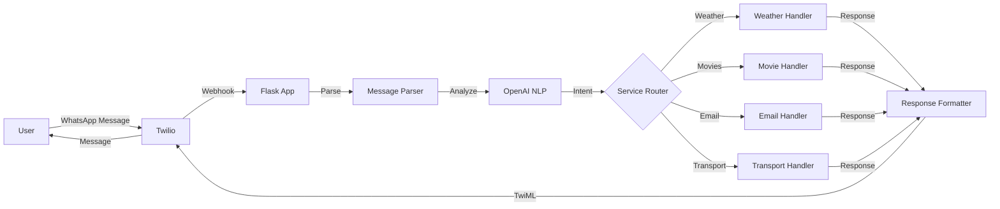

# Core System Flow

```mermaid
graph LR
    A[User] -->|WhatsApp Message| B[Twilio]
    B -->|Webhook| C[Flask App]
    C -->|Parse| D[Message Parser]
    D -->|Analyze| E[OpenAI NLP]
    E -->|Intent| F{Service Router}
    F -->|Weather| G[Weather Handler]
    F -->|Movies| H[Movie Handler]
    F -->|Email| I[Email Handler]
    F -->|Transport| J[Transport Handler]
    G & H & I & J -->|Response| K[Response Formatter]
    K -->|TwiML| B
    B -->|Message| A
```

This diagram shows the core flow from user input to response, highlighting the main components of the system.
