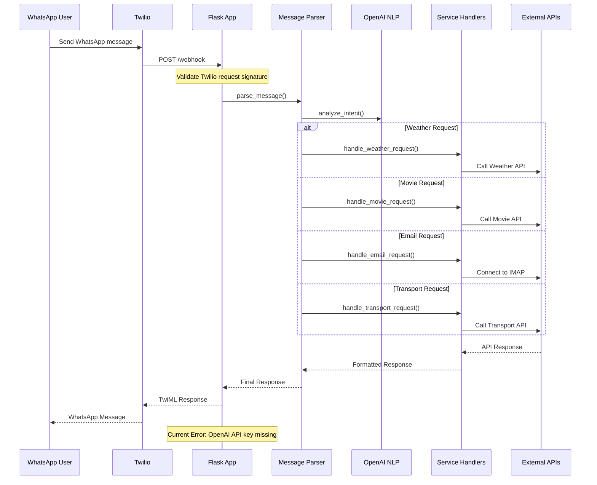

# Application Flow Diagram

```mermaid
sequenceDiagram
    participant User as WhatsApp User
    participant Twilio
    participant Flask as Flask App
    participant Parser as Message Parser
    participant NLP as OpenAI NLP
    participant Handlers as Service Handlers
    participant APIs as External APIs

    User->>Twilio: Send WhatsApp message
    Twilio->>Flask: POST /webhook
    
    Note over Flask: Validate Twilio request signature
    
    Flask->>Parser: parse_message()
    Parser->>NLP: analyze_intent()
    
    alt Weather Request
        Parser->>Handlers: handle_weather_request()
        Handlers->>APIs: Call Weather API
    else Movie Request
        Parser->>Handlers: handle_movie_request()
        Handlers->>APIs: Call Movie API
    else Email Request
        Parser->>Handlers: handle_email_request()
        Handlers->>APIs: Connect to IMAP
    else Transport Request
        Parser->>Handlers: handle_transport_request()
        Handlers->>APIs: Call Transport API
    end
    
    APIs-->>Handlers: API Response
    Handlers-->>Parser: Formatted Response
    Parser-->>Flask: Final Response
    Flask-->>Twilio: TwiML Response
    Twilio-->>User: WhatsApp Message

    Note over Flask: Current Error: OpenAI API key missing
```
